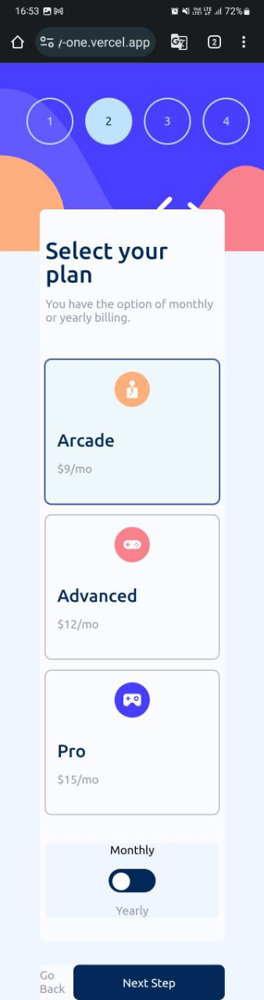
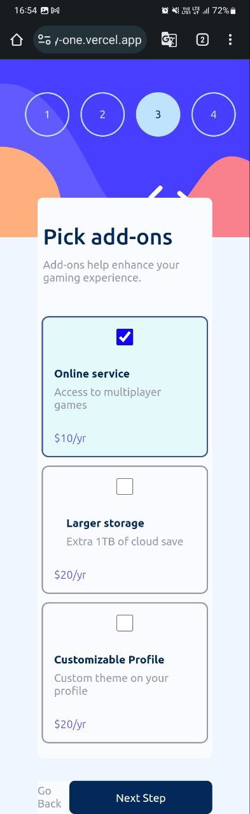
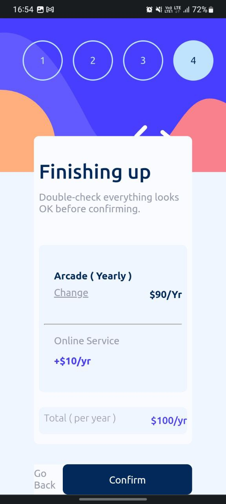

<h1 align="center">MULTI STEP FORM</h1>

<div align="center">
   Solution for a challenge from  <a href="https://www.mountblue.io/" target="_blank">MOUNTBLUE</a>.
</div>

<div align="center">
  <h3>
    <a href="https://multi-step-form-gray-one.vercel.app/">
      Demo
    </a>
    <span> | </span>
    <a href="https://github.com/vishalsharma1777/multi-step-form">
      Solution
    </a>
    <span> | </span>
    <a href="https://gitlab.com/mountblue/js/multi-step-form">
      Challenge
    </a>
  </h3>
</div>

<!-- TABLE OF CONTENTS -->

## Table of Contents

- [Overview](#overview)
  - [The challenge](#the-challenge)
  - [Screenshot](#screenshot)
  - [Links](#links)
- [My process](#my-process)
  - [Built with](#built-with)
  - [What I learned](#what-i-learned)
  - [Continued development](#continued-development)
  - [Useful resources](#useful-resources)
- [Acknowledgments](#acknowledgments)(#acknowledgments)

## Overview

### The challenge

Users should be able to:

- Complete each step of the sequence
- Go back to a previous step to update their selections
- See a summary of their selections on the final step and confirm their order
- View the optimal layout for the interface depending on their device's screen size
- See hover and focus states for all interactive elements on the page
- Receive form validation messages if:
  - A field has been missed
  - The email address is not formatted correctly
  - A step is submitted, but no selection has been made

### Screenshots


<div>


</div>


#### Mobile View

HOME PAGE


PLAN PAGE


Add Ons PAGE


Summary PAGE


Thank You PAGE


### Links

- Solution URL: [github link](https://github.com/vishalsharma1777/multi-step-form)
- Live Site URL: [vercel site](https://multi-step-form-gray-one.vercel.app/)

## My process

- I started with the mobile first approach and then moved to the desktop version.
- I used the grid and flexbox to make the layout responsive.
- I used the javascript to make the form interactive.
- I used media queries to make the layout responsive.
- DOM manipulation is used to make the form interactive.

### Built with

- Semantic HTML5 markup
- Document Object Model
- CSS custom properties
- Flexbox
- CSS Grid
- Mobile-first workflow

### What I learned

- I learned how to use the grid and flexbox to make the layout responsive.
- I learned how to use the DOM to make the form interactive.
- Dom manipulation is used to make the form interactive.

### HTML Use of Data Attributes
```html
<label for="largeStorage">
  <div class="addOnCard" data-cardName="largeStorage">
    <input
      type="checkbox"
      id="largeStorage"
      class="checkbox"
      data-priceMonthly="2"
      data-priceYearly="20"
      data-whichAddOn="Large Storage"
      data-duration="monthly"
    />
    <div class="addOnName">
      <div>
        <div class="addOnHeading">Larger storage</div>
        <div class="addOnDescription">Extra 1TB of cloud save</div>
      </div>
      <div class="planPriceMonthly pricesSide">+$2/mo</div>
      <div class="planPriceYearly pricesSide toggleDisplay">$20/yr</div>
    </div>
  </div>
</label>
```

### CSS Use of Grid
```css
.cards {
    display: grid;
    grid-template-columns: 1fr 1fr 1fr;
    gap: var(--margin-medium);
    margin-bottom: var(--margin-large);
}
```

### CSS Use of Variables
```css
:root {
    /* NEUTRAL COLORS */
    --Cool-gray: hsl(231, 11%, 63%);
    --Light-gray: hsl(229, 24%, 87%);
    --Magnolia: hsl(217, 100%, 97%);

    /*Typography*/
    --attribution-font: 11px;
    --small-font: .5rem;
    --normal-font: 1rem;
    --extra-small-heading: 1.5rem;
}
```

### JS Use of dataset
```js
// DATA MATCHER
function dataMatcher(dataCollection, toCheck, dataValue) {
    const divName = Array.from(dataCollection).filter((data) => {
        return data.getAttribute(toCheck) === dataValue;
    });
    return divName[0];
}

// HANDLING STEP CHANGE AND CIRCLE ACTIVE
function changeStepAndGoBack(circleToRemove, circleToAdd, stepToAddContainer, stepToRemoveContainer) {
    const removeCircle = dataMatcher(circles, 'data-stepCircle', circleToRemove);
    const addCircle = dataMatcher(circles, 'data-stepCircle', circleToAdd);
    const stepToAdd = dataMatcher(steps, 'data-container', stepToAddContainer);
    const stepToRemove = dataMatcher(steps, 'data-container', stepToRemoveContainer);

    if (removeCircle && addCircle && stepToAdd && stepToRemove) {
        removeCircle.classList.remove('currentStep');
        addCircle.classList.add('currentStep');
        stepToRemove.style.display = 'none';
        stepToAdd.style.display = 'flex';
    }
}
```


### Continued development

- I want to learn more about the grid and flexbox and how to use them to make the layout responsive.
- Connect it with a database to store the data.
- Send email to the user after the form is submitted.

### Useful resources

- [W3Schools](https://www.w3schools.com/) - This helped me for css. I really liked this pattern and will use it going forward.
- [MDN](https://developer.mozilla.org/en-US/) - This is an amazing article which helped me finally understand datsets and dom. I'd recommend it to anyone still learning this concept.

## Acknowledgments
I want to thank my mentors.