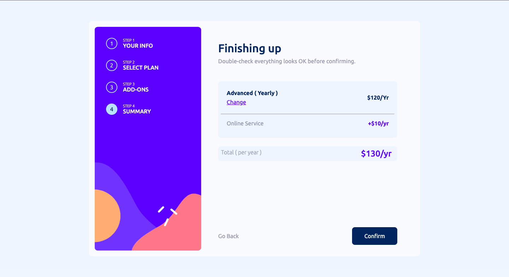

<h1 align="center">MULTI STEP FORM</h1>

<div align="center">
   Solution for a challenge from  <a href="https://www.mountblue.io/" target="_blank">MOUNTBLUE</a>.
</div>

<div align="center">
  <h3>
    <a href="https://multi-step-form-gray-one.vercel.app/">
      Demo
    </a>
    <span> | </span>
    <a href="https://github.com/vishalsharma1777/multi-step-form">
      Solution
    </a>
    <span> | </span>
    <a href="https://gitlab.com/mountblue/js/multi-step-form">
      Challenge
    </a>
  </h3>
</div>

<!-- TABLE OF CONTENTS -->

## Table of Contents

- [Overview](#overview)
  - [The challenge](#the-challenge)
  - [Screenshot](#screenshot)
  - [Links](#links)
- [My process](#my-process)
  - [Built with](#built-with)
  - [What I learned](#what-i-learned)
  - [Continued development](#continued-development)
  - [Useful resources](#useful-resources)
- [Author](#author)
- [Acknowledgments](#acknowledgments)


## Overview

### The challenge

Users should be able to:

- Complete each step of the sequence
- Go back to a previous step to update their selections
- See a summary of their selections on the final step and confirm their order
- View the optimal layout for the interface depending on their device's screen size
- See hover and focus states for all interactive elements on the page
- Receive form validation messages if:
  - A field has been missed
  - The email address is not formatted correctly
  - A step is submitted, but no selection has been made

### Screenshots

HOME PAGE
{width=300px height=200px}


PLAN PAGE


Add Ons PAGE


Summary PAGE


Thank You PAGE


### Links

- Solution URL: [Add solution URL here](https://your-solution-url.com)
- Live Site URL: [Add live site URL here](https://your-live-site-url.com)

## My process

- I started with the mobile first approach and then moved to the desktop version.
### Built with

- Semantic HTML5 markup
- CSS custom properties
- Flexbox
- CSS Grid
- Mobile-first workflow


### What I learned

- I learned how to use the grid and flexbox to make the layout responsive.

```html
<h1>Some HTML code I'm proud of</h1>
```

```css
.proud-of-this-css {
  color: papayawhip;
}
```

```js
const proudOfThisFunc = () => {
  console.log('🎉');
};
```

### Continued development

- I want to learn more about the grid and flexbox and how to use them to make the layout responsive.

### Useful resources

- [Example resource 1](https://www.example.com) - This helped me for XYZ reason. I really liked this pattern and will use it going forward.
- [Example resource 2](https://www.example.com) - This is an amazing article which helped me finally understand XYZ. I'd recommend it to anyone still learning this concept.

